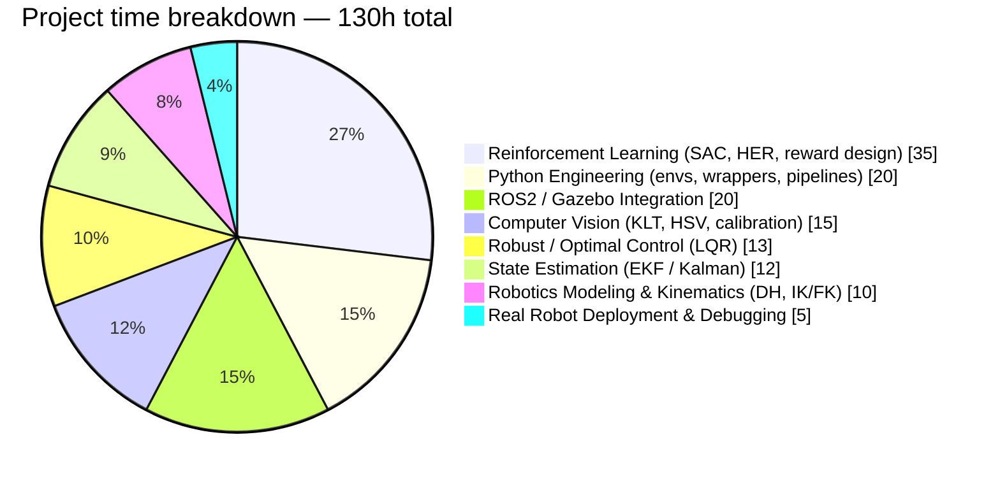

# UR7e Reinforcement Learning Suite

Reinforcement learning for a Universal Robots **UR7e** cobot: line following (simulation and real sim-to-real deployment), target reaching, and obstacle avoidance — with kinematic tools, sensor fusion (EKF), and a scientific SAC-vs-PPO comparison.

  
   
  <em>
    ▶️
    <a href="https://youtube.com/shorts/--WNZJovDO4?feature=share">
      Watch the full video on YouTube
    </a>
  </em>

And

  
   
  <em>▶️ <a href="https://youtube.com/shorts/vd7ZUFQKB6c?feature=share">Watch the full simulation on YouTube</a></em>

  

## Quick overview

This suite contains **four independent projects**. Simulations are functional, but the full transfer onto the real robot is **not validated end-to-end**: the vision/KLT chain loses the laser dot during motion, which currently blocks closed-loop control on hardware — see the [real-implementation README](line-follower-real-implementation) for details.

| # | Folder | Role | Status |
|---|---|---|---|
| 1 | [`line-follower-simulation-simple`](line-follower-simulation-simple) | Lightweight SAC trajectory-tracking demo (100% acquisition, 97% completion, 5.8mm RMS) | Validated in simulation |
| 2 | [`line-follower-simulation-complete`](line-follower-simulation-complete) | Full ROS 2/Gazebo pipeline: SAC+HER, Extended Kalman Filter, LQR singularity-adaptive control, Monte Carlo trajectories | Validated in simulation (7/10 success on held-out episodes) |
| 3 | [`line-follower-real-implementation`](line-follower-real-implementation) | Real UR7e deployment: fixed camera + TCP-mounted laser, ROS 2 Jazzy | Partial — sim-to-real not validated |
| 4 | [`target-reaching-obstacle-avoidance`](target-reaching-obstacle-avoidance) | Reaching, SAC vs. PPO statistical comparison, HER, curriculum learning, obstacle avoidance, hybrid IK+RL — two independent frameworks (Stable-Baselines3 and tf-agents) | Code complete; some analysis scripts require retraining (no included checkpoints) |

## Recommended reading order

1. Start with [`line-follower-simulation-simple`](line-follower-simulation-simple) to see the lightest working SAC model end-to-end.
2. Move to [`line-follower-simulation-complete`](line-follower-simulation-complete) for the full sensor-fusion pipeline (EKF, LQR, Monte Carlo) and the regenerated result plots.
3. Read [`line-follower-real-implementation`](line-follower-real-implementation) before connecting to real hardware, and always run its shadow test first.
4. Explore [`target-reaching-obstacle-avoidance`](target-reaching-obstacle-avoidance) for the broader RL methodology: algorithm comparison, sparse-reward techniques, curriculum learning, and a hybrid classical/RL pipeline.

## Time investment (130h)

## Important notes

### Sim-to-real gap

Line following works in simulation but is not yet robust on the real robot. The red laser dot is correctly detected at rest, but KLT tracking is lost during motion. Leading hypotheses: ambient light too strong, laser dot too thin / weakly saturated, red reflections or parasitic objects in frame, unstable camera auto-exposure.

### Missing external dependency

The Target Reaching / Obstacle Avoidance batch requires an external `ur7e_pybullet/` folder (robot URDF + meshes) that is not included here — see [`target-reaching-obstacle-avoidance/MISSING_PREREQUISITE.md`](target-reaching-obstacle-avoidance/MISSING_PREREQUISITE.md) for the recovery procedure.

### Environments

- ROS 2 Humble or Jazzy depending on the batch.
- Python 3.10/3.12 depending on the ROS installation.
- Stable-Baselines3, Gymnasium, PyTorch, NumPy, IKPy for RL simulations; tf-agents/TensorFlow for the alternative approach in batch 4.
- OpenCV for the real vision pipeline.

Each subfolder keeps its own README and commands — this root README is orientation only.

## License

MIT — see [LICENSE](LICENSE).
