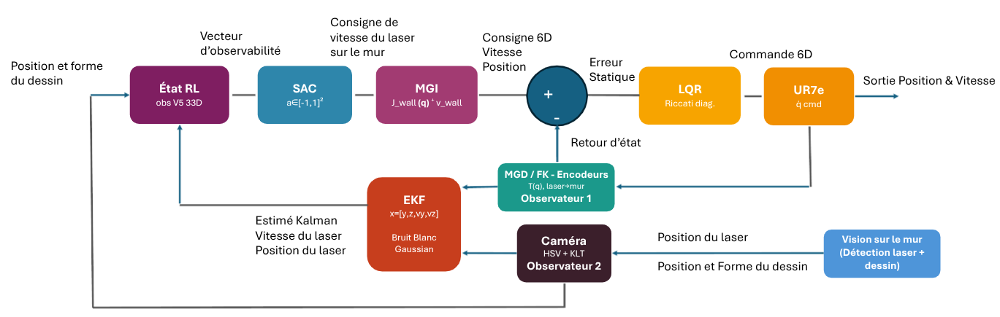

# UR7e Line Follower — Real Robot Implementation

Minimal deployment package for driving a **physical UR7e** cobot to follow a laser-pointed line on a wall, using a fixed camera and a laser mounted on the TCP, over ROS 2 Jazzy.

This folder contains only the ROS 2 package, a trained SAC model, configuration, a main launch file, and the operator commands. No training code, plots, or simulation results are included here — see [`line-follower-simulation-complete`](../line-follower-simulation-complete) for those.

<p align="center">
  
</p>

## ⚠ Status: sim-to-real not fully validated

The policy transfers correctly in simulation, but **not yet robustly on the real robot**: the red laser dot is detected reliably at rest, but the KLT tracker loses it during motion. Likely causes: ambient lighting too strong, laser dot too thin / weakly saturated, red reflections or parasitic objects in frame, unstable camera auto-exposure. This package is provided for continued work on the vision chain, not as a finished closed-loop demo — always run the **shadow test** (step 3 below) before enabling real robot motion.

## Architecture

```text
USB / RealSense color camera
        │
        ├── line / laser / goal detection
        ├── KLT (optical flow)
        └── pixel → wall-plane [y, z] homography
                         │
Encoders + TCP → calibrated forward kinematics → EKF
                         │
                wall-frame command [y, z]
                         │
        differential inverse kinematics + filter
                         │
 scaled_joint_trajectory_controller → UR7e
```

## Requirements

- Ubuntu 24.04
- ROS 2 Jazzy
- UR7e reachable on the network
- **External Control** URCap installed on PolyScope
- fixed USB color camera
- laser rigidly mounted on the TCP
- trained operator, cleared workspace, emergency stop within reach

Default configuration:

```text
ROBOT_IP=192.168.186.141
VIDEO_DEVICE=AUTO
CAMERA=1280x720 YUYV 15 fps
```

Edit `config/real.env` if needed.

## Initial setup

```bash
cd UR7e_LineFollower_Real_Implementation
chmod +x MAIN.sh scripts/*.sh
./MAIN.sh install
./MAIN.sh build
```

## 1. Extract the robot's factory calibration

With the robot powered on and reachable:

```bash
./MAIN.sh extract-calibration
```

Generated file:
```text
~/.ros/ur7e_line_follower/ur7e_calibration.yaml
```

## 2. Calibrate the camera against the wall plane

Put PolyScope in manual/reduced mode. Do not start External Control during this step.

```bash
./MAIN.sh calibrate
```

A `/line_debug` window opens. The marker should track the actual laser dot.

Terminal commands:
```text
ENTER   record a point
status  show stream status
undo    remove the last point
drop N  remove point N
save    compute and save
quit    exit
```

Take 12 points spread across the whole working area. The calibration tolerates up to three outliers, with a minimum of 9 consistent points.

Generated file:
```text
~/.ros/ur7e_line_follower/camera_wall_homography.yaml
```

## 3. Test without motion (shadow mode)

```bash
./MAIN.sh shadow
```

This validates the camera, laser, forward kinematics, EKF, kinematics, and safety checks **without** sending any trajectory to the robot. Always run this before enabling motion.

## 4. Real demonstration

1. Clear the workspace.
2. Reduced mode.
3. PolyScope speed slider at 5–10% for the first attempt.
4. Open the External Control program on PolyScope and press Play.
5. Place the laser near the start of the line.

```bash
./MAIN.sh demo
```

The command asks for exact confirmation:
```text
MOVE_UR7E_CAMERA_LASER_RL
```

## Useful commands

```bash
./MAIN.sh status
./MAIN.sh view
./MAIN.sh stop
```

## Direct ROS launch

After building and sourcing the workspace:

```bash
source /opt/ros/jazzy/setup.bash
source ros2_ws/install/local_setup.bash

ros2 launch ur7e_visual_rl_demo system.launch.py \
  robot_ip:=192.168.186.141 \
  ur_type:=ur7e \
  calibration_file:=$HOME/.ros/ur7e_line_follower/ur7e_calibration.yaml \
  video_device:=/dev/video4 \
  camera_topic:=/line_camera \
  homography_file:=$HOME/.ros/ur7e_line_follower/camera_wall_homography.yaml \
  debug_overlay:=false \
  launch_rviz:=false
```

The `/dev/videoX` number may change after reconnecting the camera. `MAIN.sh` detects it automatically.

## Directory layout

```text
UR7e_LineFollower_Real_Implementation/
├── MAIN.sh
├── README.md
├── config/real.env
├── models/line_follower_sac.zip
├── scripts/
│   ├── build.sh
│   ├── common.sh
│   ├── detect_camera.sh
│   ├── extract_calibration.sh
│   ├── status.sh
│   └── stop.sh
└── ros2_ws/src/ur7e_visual_rl_demo/
    ├── launch/system.launch.py
    ├── ur7e_visual_rl_demo/
    ├── package.xml
    ├── setup.py
    └── setup.cfg
```

## Safety

This software never replaces the robot's own safety stop. PolyScope's Stop button and the emergency stop always take priority. Never raise speed limits before a valid shadow test and a manual check of motion direction.

## License

MIT — see the root [LICENSE](../LICENSE).
