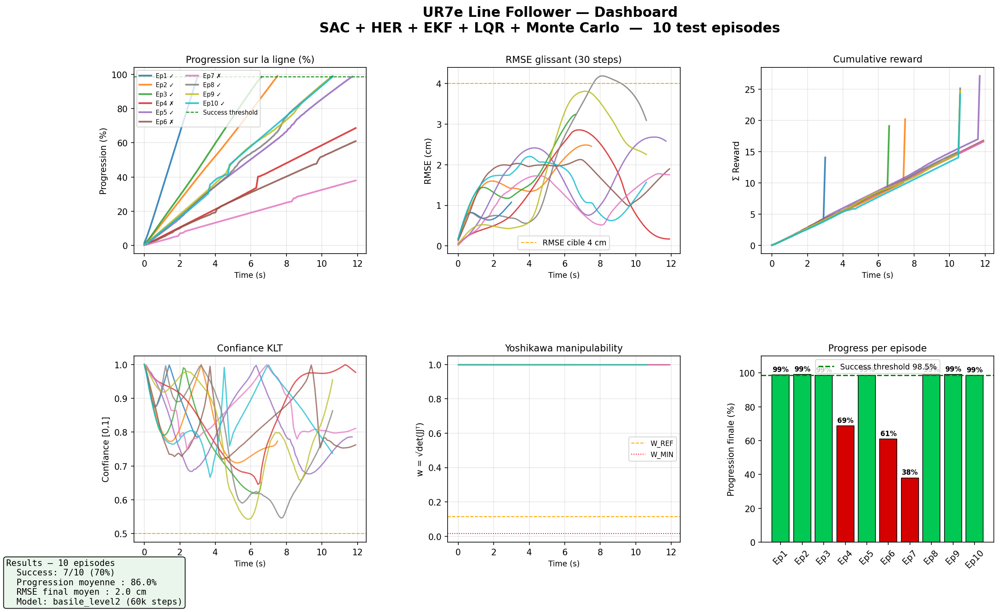
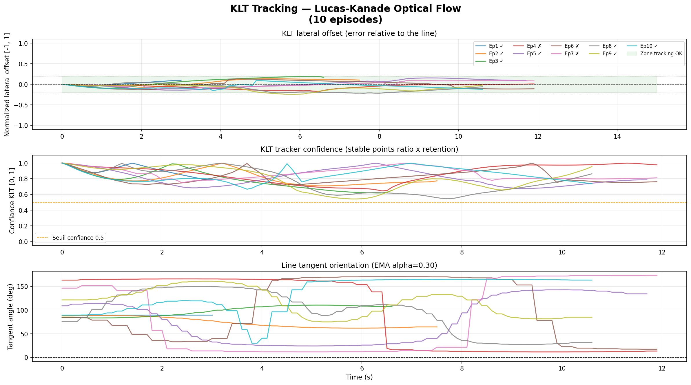
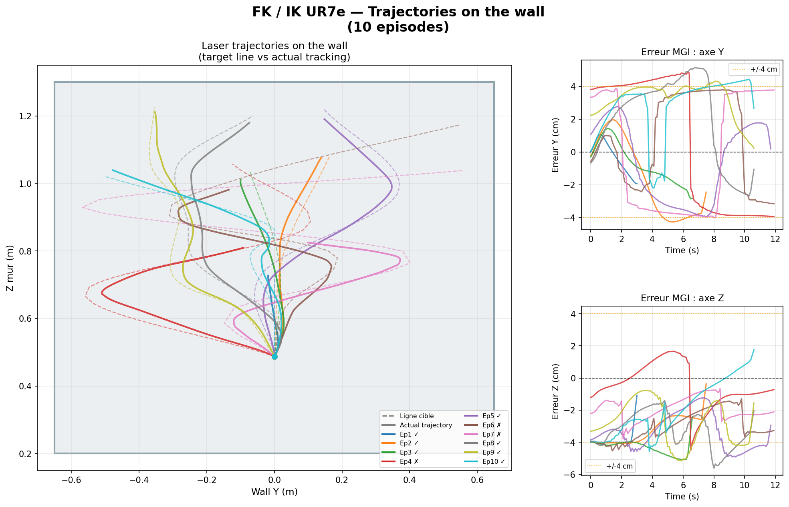
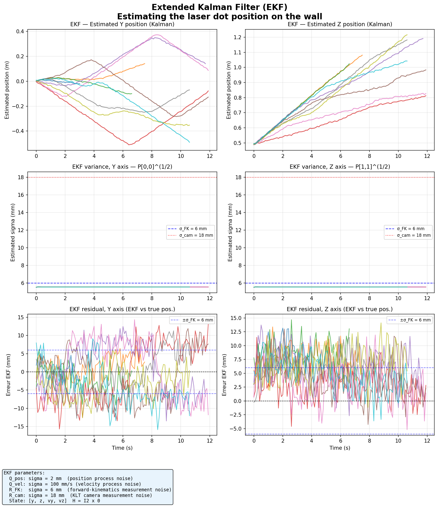
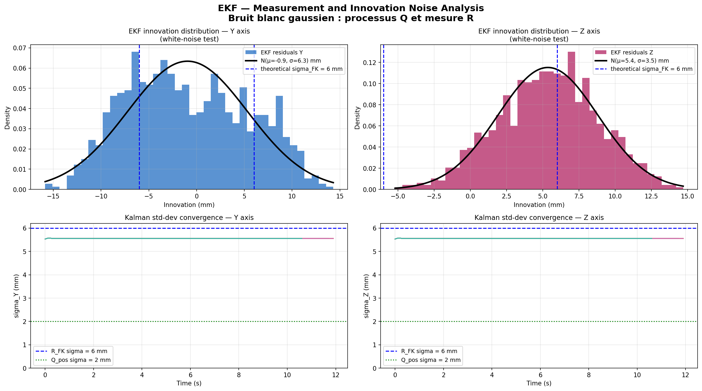
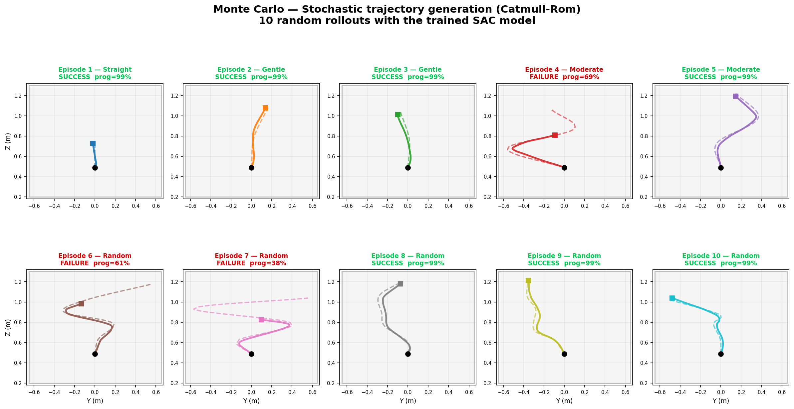
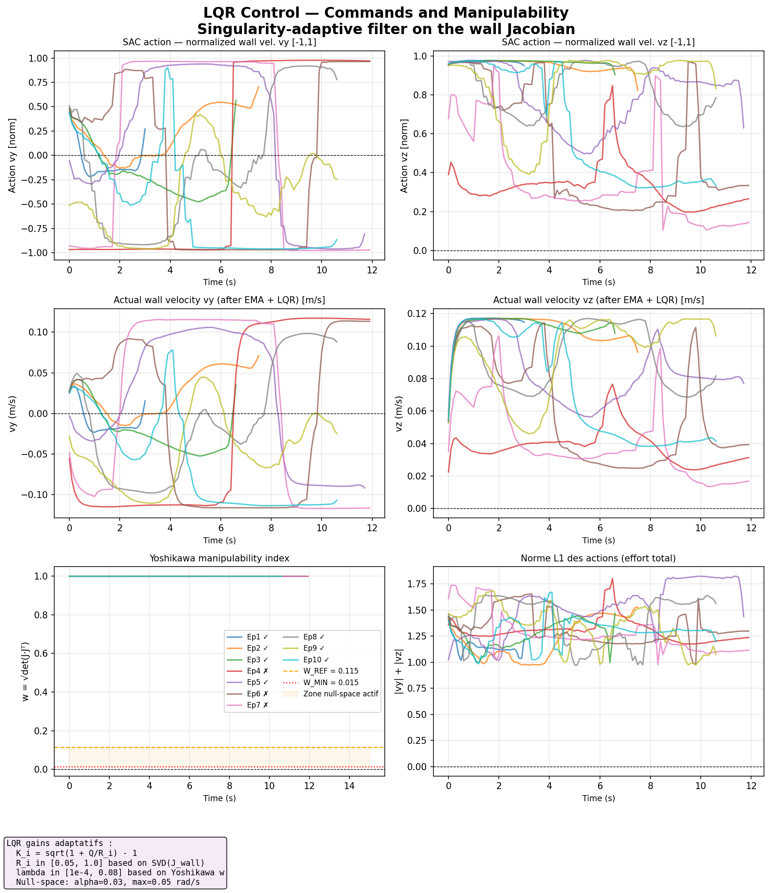

# UR7e Line Follower — Full Sensor-Fusion Pipeline (Complete Model)

A UR7e learns to track a laser-pointed line on a wall in Gazebo, combining reinforcement learning with a classical estimation/control stack: **SAC + HER, Extended Kalman Filter, LQR singularity-adaptive control, and Monte Carlo trajectory generation.**

<p align="center">
  
</p>

## Overview

The robot's TCP carries a laser pointer aimed at a wall. A simulated camera detects the laser dot via KLT optical flow; forward kinematics gives an independent estimate of the same point; an EKF fuses both into a single position/velocity estimate; a SAC policy (trained with Hindsight Experience Replay) outputs wall-frame velocity commands; and an LQR-style singularity-adaptive filter corrects the joint-space command near kinematic singularities.

| | |
|---|---|
| **Robot** | Universal Robots UR7e |
| **Simulator** | Gazebo (`ros_gz`), offline-simulated environment for fast iteration |
| **Middleware** | ROS 2 Jazzy |
| **Algorithm** | SAC + HER, 33-dimensional observation (schema V5) |
| **Estimation** | Extended Kalman Filter fusing camera (KLT) + forward kinematics |
| **Control** | Singularity-adaptive LQR correction on the wall Jacobian |
| **Trajectories** | Monte Carlo — stochastic Catmull-Rom curves for training/evaluation diversity |
| **Result (10 test episodes)** | 7/10 success (progress ≥ 98.5%), mean final RMSE ≈ 0.8 cm on successful runs |

## Results

All plots below were regenerated directly from the trained model (`models/offline_sac_final.zip`, `basile_level2`, 60k steps) by re-running 10 evaluation episodes — not mockups.

<p align="center">
  
  <br><em>KLT tracker: lateral offset, confidence, and tangent-angle estimation across 10 episodes.</em>
</p>

<p align="center">
  
  <br><em>Laser trajectories on the wall — target line vs. actual tracking, forward/inverse kinematics view.</em>
</p>

<p align="center">
  
  <br><em>Extended Kalman Filter: estimated position, variance, and residuals on both wall axes.</em>
</p>

<p align="center">
  
  <br><em>EKF innovation distribution — validating the filter's noise model against theory.</em>
</p>

<p align="center">
  
  <br><em>10 stochastic Catmull-Rom trajectories used to stress-test the trained policy.</em>
</p>

<p align="center">
  
  <br><em>SAC action vs. actual wall velocity after LQR correction, and Yoshikawa manipulability index.</em>
</p>

## Project structure

```
package/                        ROS 2 / Gazebo package (build with colcon)
├── ur7e_line_follower/          Core Python module: env, EKF, kinematics, reward, control, singularity handling
├── urdf/, worlds/, launch/      Robot description, Gazebo world, launch files
└── tests/                       Component tests

training/                        Offline (ROS-free) training & evaluation scripts
├── offline_train_ur7e_curriculum_monitored.py   Curriculum-based SAC+HER training loop
├── generate_presentation_plots.py               Regenerates all plots above from a trained model
└── ur7e_line_follower/           Same core module, importable without ROS 2

models/offline_sac_final.zip     Final trained checkpoint (60k steps)
results/monitor.csv              Training episode log (reward, length)
docs/plots/                      Generated result figures (English)
```

## Quick start

### Build the ROS 2 package
```bash
cp -r package ~/ros2_ws/src/ur7e_line_follower
cd ~/ros2_ws
source /opt/ros/jazzy/setup.bash
colcon build --packages-select ur7e_line_follower --symlink-install
source install/setup.bash
ros2 launch ur7e_line_follower simulation.launch.py
```

### Re-run evaluation and regenerate the plots above (no ROS 2 required)
```bash
cd training
pip install -r requirements.txt
PYTHONPATH="$PWD" python3 generate_presentation_plots.py \
    --model ../models/offline_sac_final.zip \
    --outdir ./plots
```

### Re-train from scratch
```bash
cd training
PYTHONPATH="$PWD" python3 offline_train_ur7e_curriculum_monitored.py
```

## Key design points

- **Reward**: continuous tracking reward over the full 0–50 cm zone (no early saturation), progress computed against both the previous value and the historical maximum to avoid reward hacking.
- **Observation (33D, schema V5)**: joint angles, TCP pose, wall-frame dot position, visual-guidance target, raw KLT camera features, EKF position + uncertainty, manipulability, and previous action/velocity — giving the policy both proprioceptive and fused-sensor information.
- **Curriculum**: progression gated on success rate rather than step count, moving from a fixed straight line to fully random Catmull-Rom trajectories.
- **Demonstrations**: expert trajectories can be injected into the SAC replay buffer to warm-start training.
- **Known limitation**: checkpoints trained on the 33D/V5 observation and current reward are not compatible with earlier versions of the environment — retraining from scratch is required after any observation/reward change.

## Requirements

- ROS 2 Jazzy (for the Gazebo package)
- Python 3.10–3.12, `stable-baselines3>=2.3,<3`, `gymnasium`, `torch`, `numpy`, `matplotlib` (see `training/requirements.txt`)

## License

MIT — see the root [LICENSE](../LICENSE).
